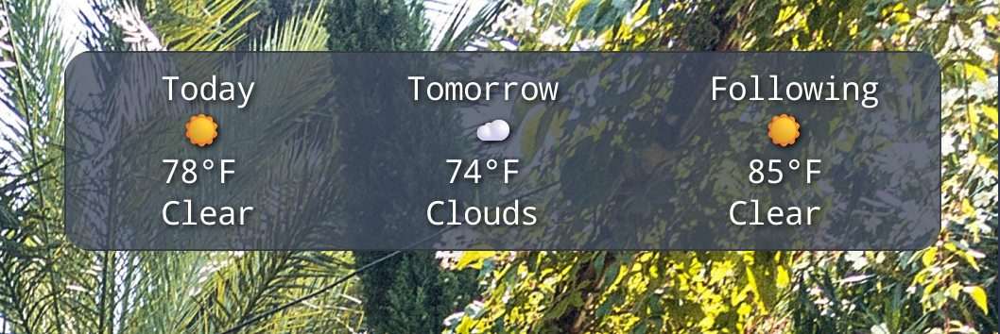

Exclude main panel round corners in picom.conf

{ match = "class_g = 'Xfce4-panel' && width > 2000";
 corner-radius = 1; },
{ match = "class_g = 'Xfce4-panel' && width < 1000";
corner-radius = 30; },
