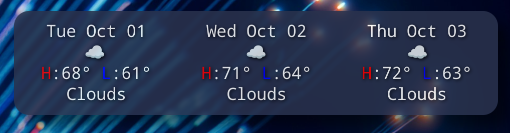

Now shows actual dates.

Create new panel.\
Edit/Apply hide_widget script to keep behind windows.

Exclude main panel round corners in picom.conf:\
"0:class_g = 'Xfce4-panel' && _NET_WM_STRUT_PARTIAL@:c",\
"30:class_g = 'Xfce4-panel' && !_NET_WM_STRUT_PARTIAL@:c",
